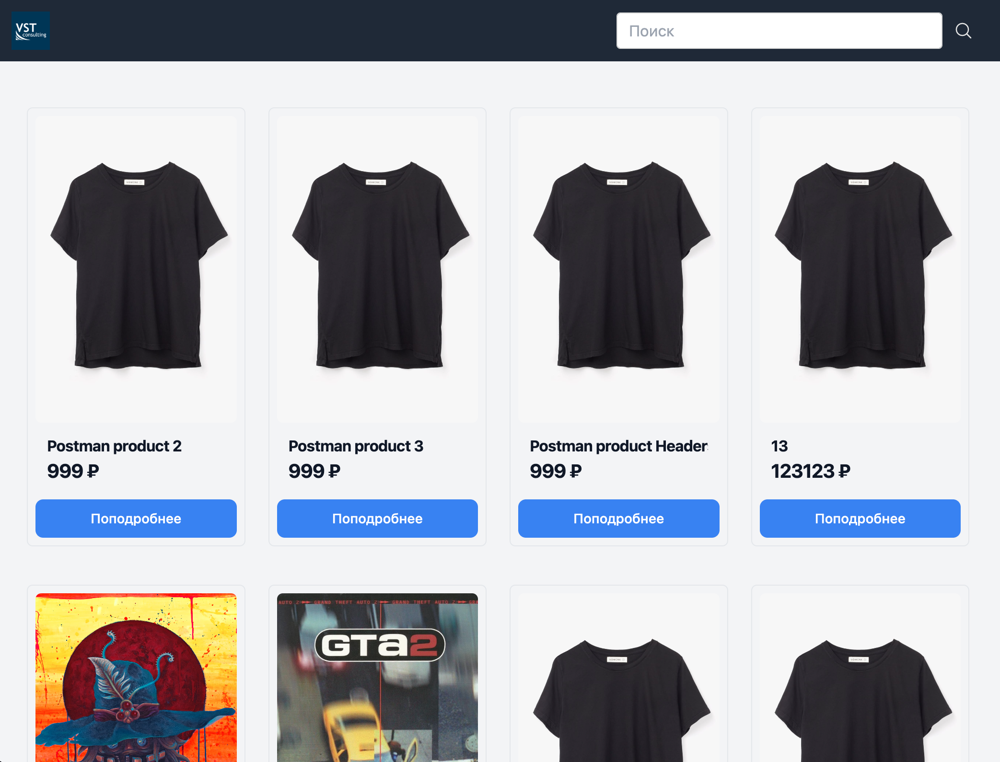
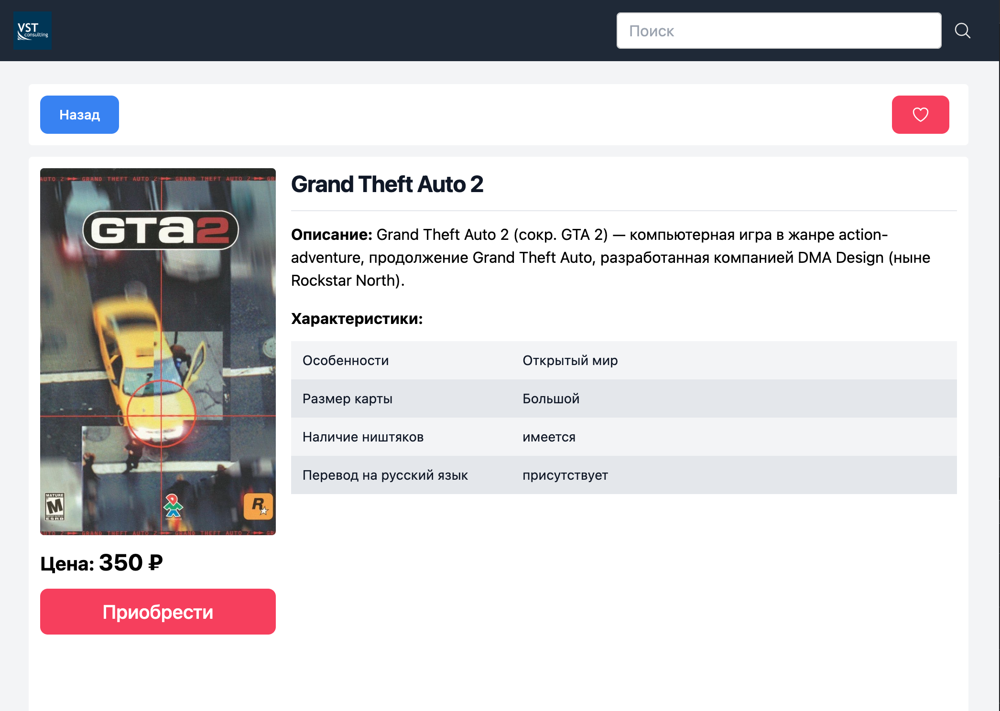
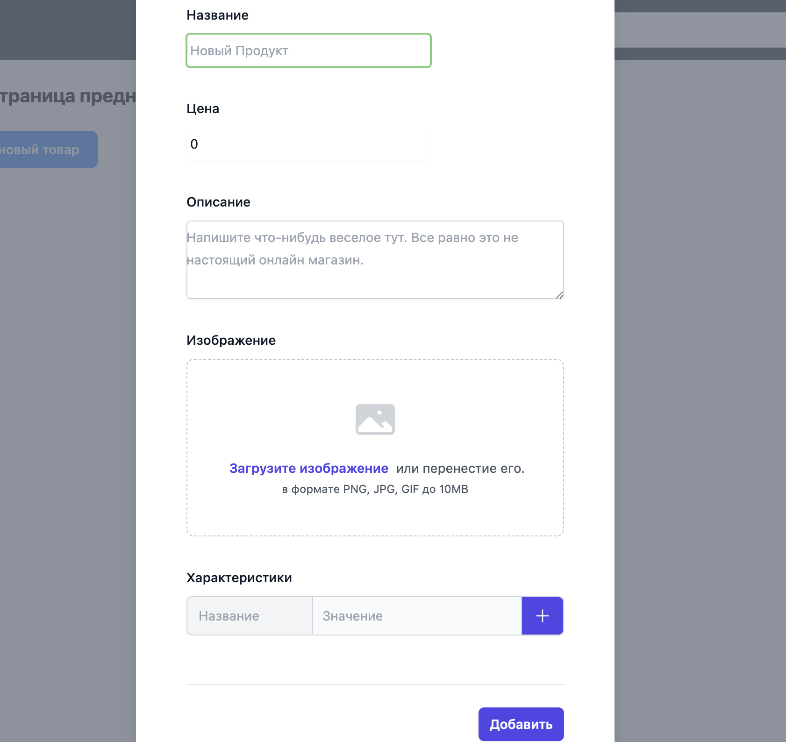
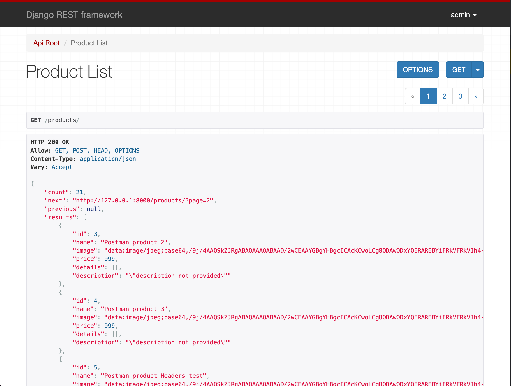

# VST Consulting Тестовое задание

Разработать простой онлайн-магазин с возможностью просмотра списка товаров и детальной записи товара. Все действия на сайте должны происходить без перезагрузки страницы.
 


Стек: Nuxt 3, Tailwind CSS, Pinia, Django.

## Frontend:
 
Использовать
*   Framework: Nuxt 3 ([https://nuxt.com/](https://nuxt.com/))
*   UI Framework любой на ваше усмотрение (например Bootstrap или Tailwind CSS).
Можно хоть на голом CSS, главное, чтобы было адаптивно и выглядело симпатично.
 
Запись списка товаров должна содержать:
*   карточки товара с фото (можно взять любые из интернета)
*   строка поиска по названию товара
 
Будет плюсом, если реализуете пагинацию.

Детальная запись товара должна содержать:
*   название товара
*   фото товара
*   цена товара
*   характеристика товара
*   описание товара

## Backend

На Backend реализовать простое API используя любой фреймворк (django + django-rest-framework, fastapi, flask или что-то еще). Использовать базу данных необязательно, но также будет плюсом.

# Скрины





# Сборка проекта

## Фронт
Для фронта все просто:
```bash
$ npm install
$ npm run dev
```

Если нужно создать билд, то делаем:
```bash
$ npm run build
```
а дальше разбираемся как это на хостинг за 59 рублей залить

## Бэк
С бэком чуть сложнее:

* Переходим в папку `backend`:

```bash
$ cd backend
```

* Затем нужно войти в [виртуальное окружение](https://docs.python.org/3/tutorial/venv.html):

```bash
$ source ./env/bin/activate
```

* Переходим в папку `server`:

```bash
(env) $ cd server
```

* Смотрим чтобы все нужные пакеты были установлены:

```bash
(env) $ pip install django
(env) $ pip install djangorestframework
```

* Ну и пробуем запустить

```bash
(env) $ python manage.py runserver
```

PS. Если что логин/пароль к админке: `admin / password123`